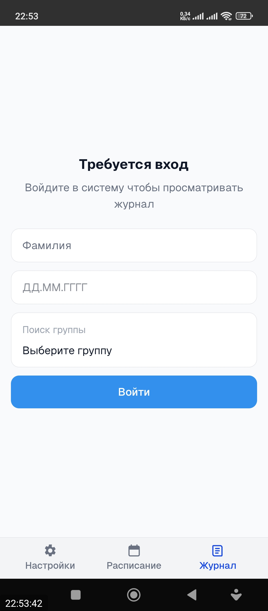
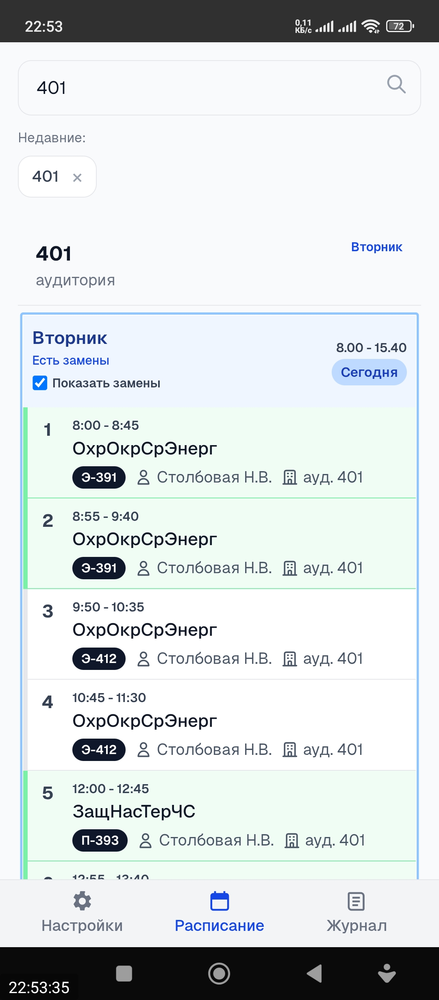
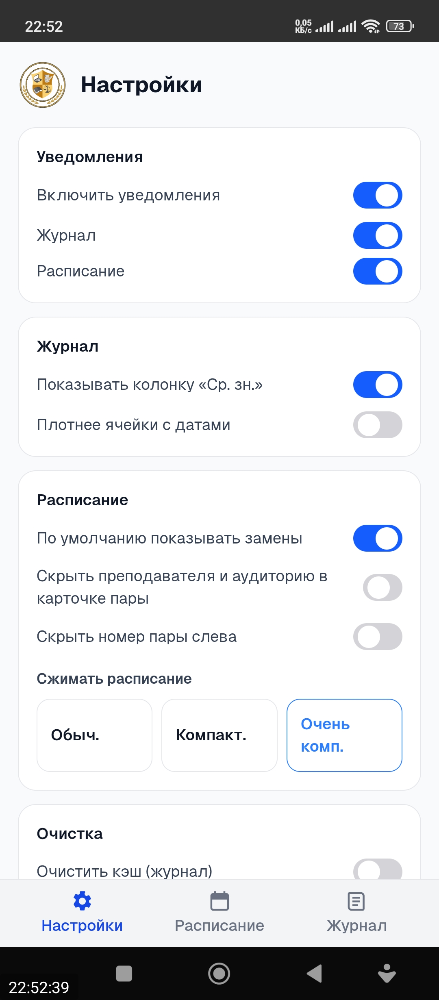

<!--
README «витрина». Папка `MiniKBP-MobilePublish` — тех. профиль сборки/публикации.
Приложение называется «Мини КБиП».
-->

# Мини КБиП

Мини‑клиент электронного журнала и расписания для КБиП — **Next.js + Capacitor (Android)**.


## Скриншоты

| Вход | Журнал | Расписание |
| --- | --- | --- |
|  |  |  |

---

## Возможности

- **Вход**: фамилия / дата рождения / группа
- **Журнал**: оценки, среднее, кэширование
- **Расписание**: пары по дням, подсветка текущей пары, статусы (добавлено/замена/снято)
- **Нативная сеть через `CapacitorHttp`** (обход CORS)
- **Встроенная консоль `Logs`** в мобильной сборке (видно запросы/ошибки)

---

## Быстрый старт (Android)

### 1) Установка

```bash
npm install
```

### 2) Сборка web-части для мобильного контейнера

```bash
npm run build:mobile
```

После команды должна появиться папка `out/`.

### 3) Синхронизация с Android проектом

```bash
npm run cap:sync
```

### 4) Открыть Android Studio

```bash
npm run cap:open:android
```

Дальше собирай APK/AAB уже из Android Studio.

---

## Режим разработки (live reload)

```bash
npm run dev
```

Для live режима через `CAP_SERVER_URL`:

```bash
# PowerShell
$env:CAP_SERVER_URL="http://192.168.0.10:3000"
npm run cap:sync
```

---

## Структура проекта (для разработки)

<details>
<summary>Открыть</summary>

```text
app/                # UI и страницы (App Router)
lib/                # клиентская логика: API, темы, синхронизация, уведомления
public/             # статические ассеты
android/            # нативный Android (Capacitor + Java воркеры/плагины)
build-mobile.js     # helper для мобильной export-сборки
capacitor.config.ts # конфигурация Capacitor (webDir=out)
```

</details>

---

## Уведомления и фоновая синхронизация

Ключевые файлы:

- `lib/client/notifications.ts`
- `lib/client/backgroundSync.ts`
- `android/app/src/main/java/com/kbp/journal/NotificationPlugin.java`
- `android/app/src/main/java/com/kbp/journal/NotificationScheduler.java`
- `android/app/src/main/java/com/kbp/journal/BackgroundSyncWorker.java`

После любых правок в этой логике обязательно:

```bash
npm run build:mobile
npm run cap:sync
```

и затем пересборка Android-проекта.

---

## Полезные команды

```bash
npm run lint
npm run build
npm run build:mobile
npm run cap:sync
npm run cap:open:android
```

---

## Версионирование релизов


- `package.json` -> `version`
- `android/app/build.gradle` -> `versionName` и `versionCode`

---

## Примечания

- Минимальный интервал `WorkManager` для periodic-задач на Android — `15 минут`.
- На некоторых прошивках (MIUI/EMUI и т.п.) фоновая работа может ограничиваться системой энергосбережения.
- Для стабильных уведомлений желательно выдать приложению все системные разрешения и исключить из battery optimization.