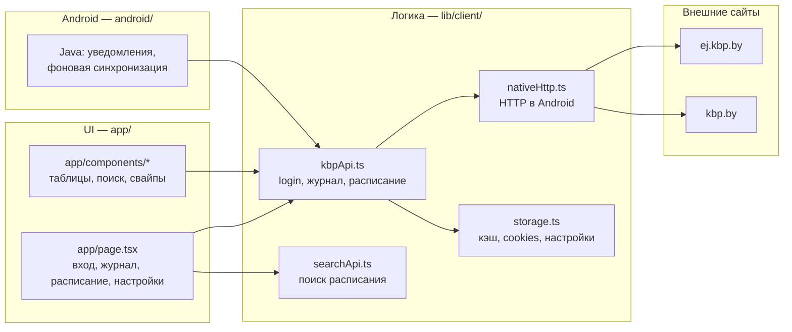

# Мини КБиП

Клиент электронного журнала (`ej.kbp.by`) и расписания (`kbp.by`) для КБиП.

Стек: **Next.js (React)** + на телефоне **Capacitor (Android WebView)**.  
Версия в `package.json` (сейчас **0.1.47**).

---

## Как устроено в двух словах

| Режим | Где крутится | Как ходит в интернет |
|--------|----------------|----------------------|
| **Android APK** | Статика из папки `out/` внутри WebView | Напрямую на `ej.kbp.by` / `kbp.by` через `CapacitorHttp` (`lib/client/nativeHttp.ts`) |
| **Браузер / `npm run dev`** | Next.js на ПК | Задумано через `/api/*`, но **`app/api/` здесь нет** — см. `../kbp-app/` |

На телефоне основная логика — **не** Next API, а `lib/client/kbpApi.ts` + сохранение в `storage`.



---

## Карта репозитория: что где лежит

### Исходники приложения (редактируешь здесь)

| Путь | Назначение | Редактировать? |
|------|------------|----------------|
| **`app/page.tsx`** | Главный экран приложения: вход, 3 вкладки (настройки / расписание / журнал), сохранение настроек | **Да** — UI и сценарии |
| **`app/components/`** | Куски интерфейса: `TimetableView`, поиск, свайп-навигация, тема, отладочная консоль | **Да** |
| **`app/dashboard/page.tsx`** | Отдельная страница `/dashboard` (старый/альтернативный журнал+расписание) | По необходимости; основной UX в `page.tsx` |
| **`app/globals.css`** | Стили, анимации (в т.ч. свайп дней расписания) | **Да** |
| **`app/layout.tsx`** | Оболочка HTML, шрифты, метаданные | Редко |
| **`lib/client/kbpApi.ts`** | Вход, загрузка журнала, расписание, парсинг HTML, кэш-ключи | **Да** — ядро данных |
| **`lib/client/nativeHttp.ts`** | HTTP-запросы в нативной сборке | **Да** — если ломается сеть/POST |
| **`lib/client/storage.ts`** | `Preferences` (телефон) / `localStorage` (браузер) | **Да** — если нужны новые ключи кэша |
| **`lib/client/searchApi.ts`** | Поиск групп/преподавателей/аудиторий на kbp.by | **Да** |
| **`lib/client/notifications.ts`**, **`backgroundSync.ts`** | Уведомления и фоновое обновление (натив) | **Да** |
| **`lib/client/platform.ts`** | `isNativeApp()` — ветка web vs Android | Редко |
| **`android/`** | Проект Android Studio, Java-плагины (уведомления, WorkManager) | **Да** — только нативные фичи |
| **`capacitor.config.ts`** | `appId`, `webDir: out`, live reload (`CAP_SERVER_URL`) | **Да** |
| **`build-mobile.js`** | Сборка APK: временно убирает `app/api*`, делает `next build` → `out/` | Менять осторожно |
| **`next.config.ts`** | `output: 'export'` — статический экспорт (без серверных роутов в APK) | Понимать, не отключать export для mobile |
| **`package.json`** | Версия, npm-скрипты | **Да** — версия релиза |
| **`public/`** | Иконки, `manifest.json`, статика | **Да** |

### Сборка и артефакты (не править руками)

| Путь | Что это |
|------|---------|
| **`out/`** | Результат `npm run build` / `build:mobile` — это грузит Capacitor в APK |
| **`.next/`** | Кэш Next.js |
| **`node_modules/`** | Зависимости |
### В родительском репозитории (`../`)

| Путь | Назначение |
|------|------------|
| **`kbp-app/`** | Параллельный Next с **`app/api/*`** (прокси для веба: login, journal, timetable, bot) |
| **`*.html`**, **`timetable-cached/`** | Снимки HTML kbp/ej для отладки парсеров |
| **`data/`** | Данные Telegram-бота |

---

## Связь: от кнопки «Войти» до оценок на экране

1. **`app/page.tsx`** — форма (фамилия, дата, группа) → вызывает `login()` из `kbpApi.ts`.
2. **`login()` (натив)**  
   - GET `ej.kbp.by/templates/login_parent.php` → парсит `S_Code`  
   - POST `ej.kbp.by/ajax.php` (`action=login_parent`)  
   - Сохраняет сессию в **`ej_cookies`** через `storageSet`.
3. Сохраняются **`ej_login_data`**, **`ej_group_id`**, настройки формы.
4. **`fetchJournal()`** — GET `parent_journal.php` с `Cookie`, парсинг таблицы в `parseJournalData()`, кэш **`cached_journal_data`**.
5. **`fetchTimetable(groupId)`** — цепочка запросов на `kbp.by`, кэш **`cached_timetable_data`**.
6. UI читает кэш сразу, потом в фоне обновляет (плашка «Обновление…»).

Повторный вход / обновление журнала — та же цепочка: сначала кэш, потом сеть (логика в `page.tsx` и `dashboard/page.tsx`).

### Важные ключи в storage

| Ключ | Содержимое |
|------|------------|
| `ej_login_data` | JSON: фамилия, группа, дата рождения |
| `ej_cookies` | Строка cookies после входа (нужна для журнала) |
| `ej_group_id` | ID группы |
| `cached_journal_data` | Распарсенный журнал |
| `cached_timetable_data` | Распарсенное расписание |
| `cached_student_fio` | ФИО из шапки журнала |
| `app_settings_v1` | Тема, уведомления, плотность UI и т.д. |

Парсинг оценок: `lib/client/kbpApi.ts` → `parseJournalData()`. Красные отметки (`alert_m` в HTML) → поле `kind: "alert"` → красный текст в таблице.

---

## Что редактировать под типичные задачи

| Задача | Где править |
|--------|-------------|
| Текст кнопок, вкладки, экран входа | `app/page.tsx` |
| Таблица журнала, цвета оценок | `app/page.tsx` (журнал), `app/dashboard/page.tsx` |
| Расписание: свайп дней, пары, замены | `app/components/TimetableView.tsx`, `app/globals.css` |
| Поиск по группам/преподавателям | `app/components/TimetableSearch*.tsx`, `lib/client/searchApi.ts` |
| Сломался вход / NO_COOKIES / сессия | `lib/client/kbpApi.ts` (`login`, `fetchJournal`), `nativeHttp.ts` |
| Не подтягиваются оценки / парсер | `lib/client/kbpApi.ts` → `parseJournalData` |
| Версия в «О приложении» | `package.json` + строка версии в `app/page.tsx` (настройки) |
| Уведомления, фон на Android | `android/.../journal/*.java`, `lib/client/notifications.ts`, `backgroundSync.ts` |
| Имя приложения, package id | `capacitor.config.ts`, `android/app/build.gradle` |
| Скриншоты для GitHub | `readme-assets/` + этот README |

---

## Команды

### Разработка UI в браузере

```bash
npm install
npm run dev
```

Открыть `http://localhost:3000`. Учти: без `app/api/` запросы на `/api/*` из `kbpApi.ts` **не сработают** — полноценный веб-прокси в `../kbp-app/`.

### Сборка Android (офлайн APK, как у пользователей)

```bash
npm install
npm run build:mobile   # → папка out/
npm run cap:sync
npm run cap:open:android
```

APK/AAB собирается в Android Studio из `android/`.

### Live reload на телефоне (грузит dev-сервер, не `out/`)

```bash
npm run dev
```

```powershell
$env:CAP_SERVER_URL="http://192.168.0.10:3000"   # IP ПК в LAN
npm run cap:sync
npm run cap:open:android
```

Нужен запущенный Next с **работающими** `/api` (сейчас — из `kbp-app` или перенесённые роуты).

### Версия релиза

Перед APK сверь:

- `package.json` → `version`
- `android/app/build.gradle` → `versionName`, `versionCode`
- Текст в настройках в `app/page.tsx`

---

## Отладка на телефоне

- В UI есть **Logs** (`app/components/MobileConsole.tsx` / `DebugConsole.tsx`) — `console.log`, ошибки, `fetch`.
- Логи HTTP: префикс `[HTTP]` в `nativeHttp.ts`, `[KBP]` в `kbpApi.ts`.

---

## Краткий итог

- **Главная точка разработки** — эта папка: `app/` + `lib/client/` + `android/`.
- **Мобильное приложение** не использует Next API в проде — только статика `out/` + прямые запросы.
- **`../kbp-app/`** — веб-прокси с `/api` для браузера и бота.
